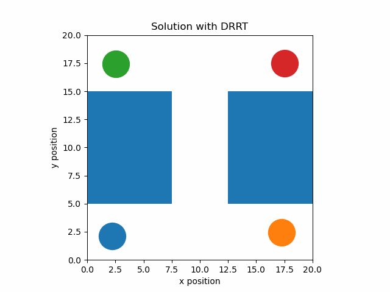

# Centralized Multi-robot Planning using Discrete RRT
## Minh Nguyen, Wesley Yang and Ayush Sachdeva

## Overview
Motion planning for multiple robots in a shared environment poses a complex challenge. The centralized multi-robot planning approach treats all robots as a single composite system with many degrees of freedom, aiming to compute a plan for all robots simultaneously.

### Problem Statement
A naive solution constructs a Probabilistic Roadmap (PRM) for each robot and then attempts to plan a path using a typical graph search within the composite PRM. However, this approach is not scalable due to the exponential growth in the number of vertices; given `k` robots, each with a PRM of `n` nodes, the composite PRM will have `n^k` vertices, becoming prohibitively expensive.

### Solution: Discrete RRT (dRRT)
To address the computational challenge, the project implements a discrete version of the Rapidly-exploring Random Tree (dRRT) algorithm. dRRT implicitly searches the composite roadmap and constructs a tree over it, with the goal of connecting the start state to the goal state without explicitly generating the entire composite PRM.

### Usage

#### Clean

>make clean

#### Compile

In project6 folder, run these commands to compile 
>make

#### Usage

To run scenario 1
>./scenario1

To run scenario 2
>./scenario2

To run scenario 3
>./scenario3

To run scenario 4
>./scenario4

To run scenario 5
>./scenario5

#### Visualization

Visualization of the solutions is in `visualization.ipynb` notebook. Here is a visualization of scenario 1:

### References
- K. Solovey, O. Salzman, and D. Halperin. "Finding a needle in an exponential haystack: Discrete RRT for exploration of implicit roadmaps in multi-robot motion planning." *arXiv preprint arXiv:1305.2889* (2013).